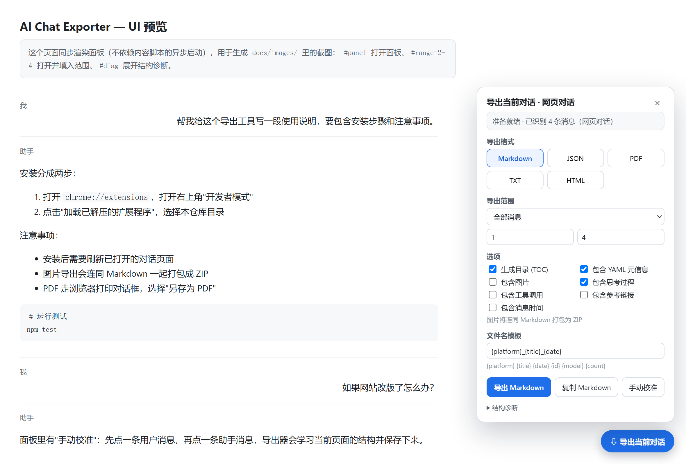
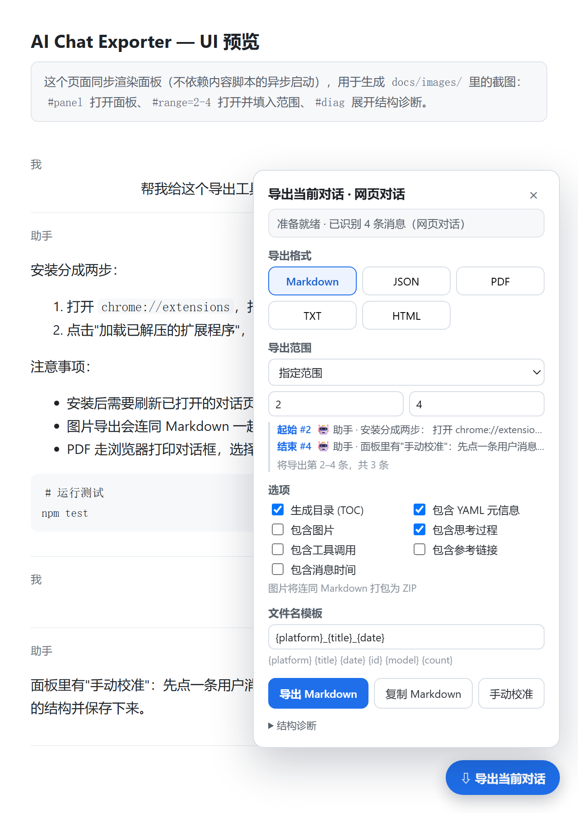
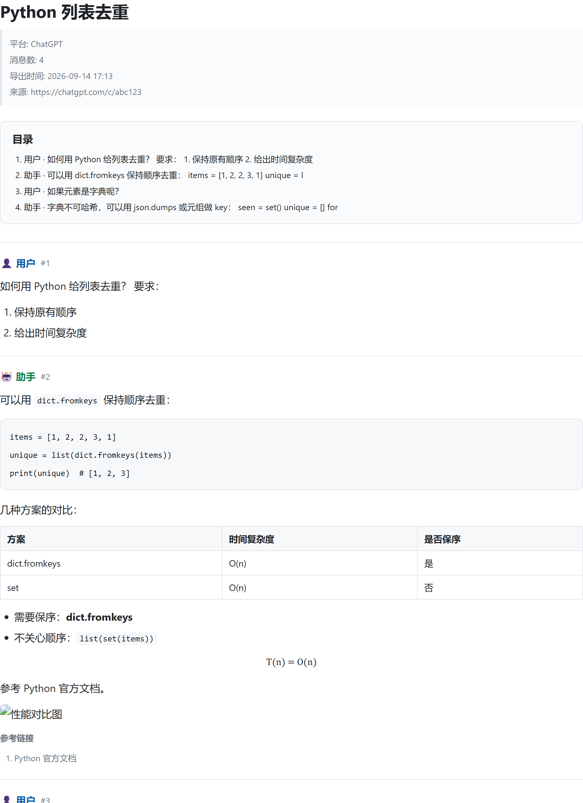
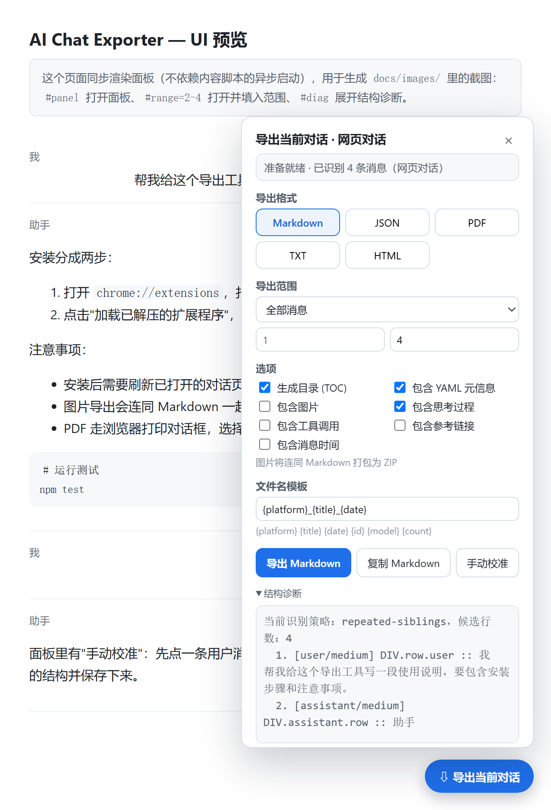

# 使用教程

> 面向使用者，从安装到进阶。全程本地运行，不需要登录我们的任何服务（本来也没有服务器）。
> 面板上的每个控件都能在文末的[控件速查表](#面板控件速查表)里找到解释。

- [1. 开始之前](#1-开始之前)
- [2. 安装扩展](#2-安装扩展)
- [3. 确认装好了](#3-确认装好了)
- [4. 认识面板](#4-认识面板)
- [5. 第一次导出（Markdown）](#5-第一次导出markdown)
- [6. 五种格式怎么选](#6-五种格式怎么选)
- [7. 只导出其中几条](#7-只导出其中几条)
- [8. 把图片一起带走](#8-把图片一起带走)
- [9. 导出 PDF](#9-导出-pdf)
- [10. 可选内容：思考过程 / 工具调用 / 参考链接 / 时间](#10-可选内容思考过程--工具调用--参考链接--时间)
- [11. 文件名模板](#11-文件名模板)
- [12. 网站改版了怎么办](#12-网站改版了怎么办)
- [13. 长对话与虚拟滚动](#13-长对话与虚拟滚动)
- [14. 进阶：JSON 字段与脚本调用](#14-进阶json-字段与脚本调用)
- [15. 常见问题](#15-常见问题)
- [16. 卸载与清理](#16-卸载与清理)
- [17. 面板控件速查表](#面板控件速查表)

---

## 1. 开始之前

| 项目 | 要求 |
| --- | --- |
| 浏览器 | Chrome / Edge 等 Chromium 内核浏览器（Manifest V3，建议 104+） |
| 支持的站点 | ChatGPT（chatgpt.com、chat.openai.com）、DeepSeek（chat.deepseek.com）、豆包（doubao.com） |
| 其它站点 | 其它聊天页面可用"通用适配器"，点工具栏图标即可在页面上注入面板（识别效果取决于页面结构） |
| 隐私 | 所有内容都在浏览器本地处理，不上传任何数据 |

## 2. 安装扩展

### 方式 A：从源码加载（推荐给自己用 / 开发）

```bash
git clone https://github.com/<你的用户名>/<仓库名>.git
```

1. 打开 `chrome://extensions`（Edge 是 `edge://extensions`）
2. 打开右上角的 **开发者模式**
3. 点击 **加载已解压的扩展程序**，选择仓库根目录（能看到 `manifest.json` 的那一层）
4. 安装完成后，**刷新你已经打开的对话页面**——内容脚本只在页面加载时注入

### 方式 B：用打包好的 ZIP（Release 下载）

1. 下载 Release 里的 `ai-chat-exporter-<版本>.zip` 并解压到一个固定目录（别放在临时目录，删了扩展就失效）
2. 之后同方式 A 的第 1–4 步，选择解压出来的文件夹
3. 以后升级：覆盖该目录 → 回到 `chrome://extensions` 点 **重新加载** → 刷新对话页面

## 3. 确认装好了

- **看页面**：打开任一场对话，右下角出现蓝色 **⇩ 导出当前对话** 按钮即安装成功。
- **看工具栏**：点扩展图标，面板会展开/收起；在没有预先声明匹配的站点上，这一步会临时注入面板脚本。
- **零风险试用**：直接用浏览器打开仓库里的 `demo/index.html`（双击即可），里面有一段模拟对话，可以完整走一遍导出流程。
- **自检**：打开 `demo/selftest.html`，页面标题变成 `SELFTEST OK` 说明导出流水线在本机浏览器里工作正常。

## 4. 认识面板

<p align="center">
  
</p>

面板从上到下依次是：**识别状态** → **导出格式** → **导出范围** → **选项** → **文件名模板** → **操作按钮** → **结构诊断**。
面板是浮在页面上的，不遮挡操作：把面板关掉（右上角 ×）后只会留下右下角的圆按钮。

## 5. 第一次导出（Markdown）

1. 打开对话页面，点 **⇩ 导出当前对话**
2. 顶部状态会显示识别结果，例如：`准备就绪 · 已识别 42 条消息（ChatGPT）`
3. 保持默认的 **Markdown** 和「全部消息」
4. 点 **导出 Markdown** → 浏览器下载 `.md` 文件（默认在下载目录）

得到的 Markdown 结构如下（节选自 `examples/chatgpt-sample.md`）：

```markdown
---
title: "Python 列表去重"
platform: ChatGPT
platform_id: chatgpt
url: "https://chatgpt.com/c/abc123"
conversation_id: abc123
exported_at: "2026-09-13T10:45:51.346Z"
message_count: 4
exporter: AI Chat Exporter 0.1.0
schema: "ai-chat-exporter/conversation@1"
---

# Python 列表去重

> **平台**: ChatGPT ｜ **消息数**: 4 ｜ **导出时间**: 2026-09-13 18:45
>
> 来源: <https://chatgpt.com/c/abc123>

## 目录

- [1. 👤 用户](#1--用户)
- [2. 🤖 助手](#2--助手)

---

## 1. 👤 用户

如何用 Python 给列表去重？
要求：
1. 保持原有顺序
2. 给出时间复杂度

---

## 2. 🤖 助手

可以用 `dict.fromkeys` 保持顺序去重：

```python
items = [1, 2, 2, 3, 1]
unique = list(dict.fromkeys(items))
```

| 方案 | 时间复杂度 | 是否保序 |
| --- | --- | --- |
| dict.fromkeys | O(n) | 是 |
```

要点：

- **front matter** 记录标题、平台、链接、会话 ID、导出时间、消息数、schema 版本，方便归档与批量处理；
- **目录**（可在选项里关掉）带锚点，点击能跳到对应消息；
- 每条消息一个二级标题，用户/助手用不同 emoji 与颜色区分；
- 代码块保留语言标注，表格、列表、引用、公式（`$…$` / `$$…$$`）都是标准 Markdown。

## 6. 五种格式怎么选

在「导出格式」里点选，主按钮文字会跟着变；点击主按钮即导出当前格式。

| 格式 | 文件 | 适合场景 | 说明 |
| --- | --- | --- | --- |
| **Markdown** | `*.md` | 归档、笔记软件（Obsidian / Notion / Typora）、发博客 | 最完整，含 front matter 与目录 |
| **JSON** | `*.json` | 二次加工、做数据集、喂给脚本 | 结构化，字段见[第 14 节](#14-进阶json-字段与脚本调用) |
| **PDF** | `*.pdf` | 打印、发给别人、正式留档 | 打开 A4 打印页 → 另存为 PDF（见[第 9 节](#9-导出-pdf)） |
| **HTML** | `*.html` | 不想装 Markdown 阅读器、直接分享 | 单个自包含文件，样式内联 |
| **纯文本** | `*.txt` | 贴进聊天窗口、做文本 diff | 只有角色与正文 |

> 「复制 Markdown」按钮把当前会话的 Markdown 直接放进剪贴板，适合粘贴到笔记里（PDF 格式下不可用）。

## 7. 只导出其中几条

把「导出范围」从 `全部消息` 切成 **`指定范围`**，下面会出现 `起始` / `结束` 两个输入框，
并且**每个序号旁会实时显示这条消息是谁说的、开头是什么**：

<p align="center">
  
</p>

```
起始 #2   🤖 助手 · 安装分成两步： 打开 chrome://extensions …
结束 #4   🤖 助手 · 面板里有"手动校准"：先点一条用户消息 …
将导出第 2–4 条，共 3 条
```

规则：

| 情况 | 行为 |
| --- | --- |
| 序号怎么数 | 从 **1** 开始，**包含**起始与结束两条 |
| 只填起始 | 结束留空 = 从起始一直到最后一条 |
| 填了超出总数的数字 | 该行**标红显示"超出范围"**，导出时按实际范围夹取（不会报错，也不会误导出全部） |
| 结束小于起始 | 取起始那一条 |
| 想恢复全量 | 下拉切回「全部消息」 |
| 不确定第几条是什么 | 看序号旁的预览；或展开「结构诊断」，里面按同样顺序列出每条的角色与开头，鼠标悬停预览可看更长内容 |

导出后的子集**会重新编号**：原来第 3 条在新文件里是 `## 1.`，`message_count` 与文件名里的 `{count}` 也都按子集计算。
JSON 里会额外记录范围：`"scope": { "mode": "range", "from": 3, "to": 4 }`。

> 面板里的序号**始终对应完整会话**：做一次部分导出不会让序号错位。
> 参考样例：`examples/chatgpt-partial-messages-3-4.md`。

## 8. 把图片一起带走

勾选「包含图片」后，导出不再是单个文件，而是一个 ZIP：

```
chatgpt_Python 列表去重_20260913-1845.zip
├── chatgpt_Python 列表去重_20260913-1845.md   ← 文档里的图片链接已改写为 images/…
└── images/
    └── image-001-chart.png                    ← 会话里出现的图片
```

- 图片文件名按顺序编号并带上原始文件名片段（`image-001-chart.png`），便于对照；
- 只有**会话里出现过的图片**会被下载，头像、图标这类装饰不会打包；
- 个别图片可能因为防盗链或需要鉴权而失败，面板会提示失败数量，文档本身照常导出；
- 不想打包图片时不要勾选，Markdown 里会保留原始图片 URL。

## 9. 导出 PDF

1. 格式选 **PDF** → 点 **导出 PDF**
2. 扩展会新开一个 A4 排版的页面并自动唤起打印对话框
3. 在"目标打印机"里选择 **另存为 PDF** → 保存

<p align="center">
  
</p>

打印设置建议：

- 勾选 **背景图形**（否则代码块底色等会丢失）；
- 页眉页脚可以关掉（文档里已经有标题、来源与导出时间）；
- 边距用默认即可——打印页自己设了 `@page { size: A4; margin: 16mm 14mm }`；
- 代码块、表格、图片都设置了"避免跨页断开"。

如果新窗口被拦截：允许该站点的弹窗后重试。生成 PDF 需要你在打印窗口点一次保存，这是浏览器的限制（扩展无法静默生成 PDF）。

## 10. 可选内容：思考过程 / 工具调用 / 参考链接 / 时间

| 选项 | 效果 |
| --- | --- |
| 包含思考过程 | 把模型的 reasoning / 思考块导出为 `<details><summary>思考过程</summary>…</details>`（Markdown 折叠块，PDF/HTML 里也是折叠块） |
| 包含工具调用 | 导出工具调用区块（ChatGPT / DeepSeek / 豆包 里出现过的工具步骤） |
| 包含参考链接 | 把消息里的网页引用整理成编号列表，附在对应消息末尾 |
| 包含消息时间 | 在每条消息标题后附加页面提供的时间戳 |
| 生成目录 (TOC) | 在文档开头生成带锚点的目录 |
| 包含 YAML 元信息 | 是否输出 front matter |

这些开关会**和面板设置一起记住**，下次打开面板保持上次的选择。

## 11. 文件名模板

默认模板是 `{platform}_{title}_{date}`，可在输入框里改成自己喜欢的格式：

| 占位符 | 含义 | 示例 |
| --- | --- | --- |
| `{platform}` | 平台 ID | `chatgpt` |
| `{platformLabel}` | 平台显示名 | `ChatGPT` |
| `{title}` | 会话标题（取自页面标题） | `Python 列表去重` |
| `{date}` | 导出时间 | `20260913-1845` |
| `{id}` | 会话 ID（若页面提供） | `abc123` |
| `{model}` | 模型名（若页面提供） | `gpt-4o` |
| `{count}` | 导出消息条数（部分导出时为子集条数） | `4` |

非法字符（`\ / : * ? " < > |`）会被替换为 `-`，过长会截断，不会产生无法保存的文件名。

## 12. 网站改版了怎么办

站点改版后，如果面板显示 **"未识别到消息"** 或角色明显错位，用两步恢复：

1. **看诊断**：展开面板底部「结构诊断」

   <p align="center"></p>

   ```
   当前识别策略: repeated-siblings，候选行数：4
     1. [user/high]        DIV.row.user :: 帮我给这个导出工具写一段使用说明…
     2. [assistant/high]   DIV.assistant.row :: 助手 · 安装分成两步…
   ```

   - `platform-selectors` = 命中了内置选择器；`repeated-siblings` = 用结构启发式发现的；`custom-rules` = 用的是你校准的规则；
   - 每行的置信度：`high`（属性/测试 ID 明确）/ `medium`（类名线索）/ `low`（靠交替推断）/ `calibrated`（校准）。

2. **手动校准**：点 **手动校准** → 页面顶部出现提示 → **先点一条"用户"消息** → 再**点一条"助手"消息**。
   导出器会学习这两条所在行的结构特征并存下来，之后该站点的导出优先使用这组规则。想放弃按 `Esc`。
   想撤销学习结果：展开「结构诊断」→ 点 **清除已学习结构**。

> 校准规则按站点域名保存（`chrome.storage.local`），只在你的浏览器里，不会上传。

### 角色（用户 / 助手）判断不准怎么办

判不准时导出器不会装作知道，而是显式标出来：

- **范围预览**里会写成 `👤 用户（角色为推断）` —— 括号里的字说明这条角色是推断出来的；
- **状态栏**会出现 `⚠ 角色可能判断有误，请核对后再导出`；
- **「结构诊断」**每行都给出依据：`high`（读到 `data-*` / testid）、`medium`（类名或 markdown 容器线索）、`low`（交替推断，或与相邻消息冲突后被修正）。

看到这些提示时，用上面的「手动校准」点两条消息即可让后续导出改用页面真实结构。

判定规则本身也会自动兜底：能匹配**全部**消息行的 testid 会被忽略（它命名的是"第几轮"，不是说话人）、被多行**共享**的外层容器不再当作角色依据、首条消息是助手时不会强行假设"第一条一定是用户"；若所有消息被判成同一角色，则回退为按「用户/助手」交替推断并给出告警。

## 13. 长对话与虚拟滚动

聊天页面通常只渲染"当前视口附近"的消息，很长的对话请**先向上滚动到最早的一条**，让历史都渲染出来，再导出。
如果实在太多，可以分段导出（例如 1–200、201–400），再用 Markdown 合并。

## 14. 进阶：JSON 字段与脚本调用

### JSON 结构

```jsonc
{
  "schema": "ai-chat-exporter/conversation@1",
  "platform": "chatgpt",              // 平台 ID
  "platformLabel": "ChatGPT",
  "title": "Python 列表去重",
  "url": "https://chatgpt.com/c/abc123",
  "conversationId": "abc123",
  "model": null,                       // 页面提供时才有
  "exportedAt": "2026-09-13T10:45:51.346Z",
  "locale": "zh-CN",
  "messageCount": 4,
  "messages": [
    {
      "index": 0,
      "role": "user",                  // user | assistant | system | tool
      "markdown": "如何用 Python 给列表去重？…",
      "text": "如何用 Python 给列表去重？…",   // 纯文本，便于搜索
      "images": [{ "url": "https://…/chart.png", "alt": "性能对比图" }],
      "citations": [{ "url": "https://…", "title": "Python 官方文档" }],
      "reasoning": null,               // 勾选「包含思考过程」时才有
      "toolCalls": null,
      "createdAt": null
    }
  ],
  "meta": {
    "exporter": { "name": "AI Chat Exporter", "version": "0.1.0", "engine": "0.1.0" },
    "extraction": { "strategy": "platform-selectors", "hints": "chatgpt", "rows": 4, "calibrated": false },
    "warnings": [],
    "scope": { "mode": "full" }        // 部分导出时为 range + from/to
  }
}
```

### 在页面里脚本调用

面板与内容脚本在同一页面上下文中暴露了一个调试接口 `window.__AICE__`（在 DevTools 控制台可用）：

```js
// 当前平台
__AICE__.platform;                       // "chatgpt" / "deepseek" / "doubao" / "generic"

// 用当前面板设置抽取一次（不下载）
const extraction = __AICE__.extract(__AICE__.getPanel().getSettings());
extraction.conversation.messageCount;

// 只导出第 3–4 条并拿到 Markdown 字符串
const partial = __AICE__.extract({ ...__AICE__.getPanel().getSettings(), scope: { mode: 'range', from: 3, to: 4 } });
AIChatExporter.core.serialize.toMarkdown(partial.conversation, { locale: 'zh-CN', includeToc: true });

// 查看/清除已学习的校准规则
__AICE__.getRules();
__AICE__.resetRules();
```

核心模块也都在 `window.AIChatExporter` 下（`core.engine` / `core.serialize` / `core.zip` / `core.range` …），
可以拿来写自己的导出脚本。

## 15. 常见问题

**面板没出现？** 刷新页面；或在 `chrome://extensions` 里确认扩展已启用；或点一下浏览器工具栏的扩展图标。

**识别到 0 条消息？** 见[第 12 节](#12-网站改版了怎么办)：先看诊断，再手动校准。

**导出的是空文件？** 对话还没渲染完（切到别的会话再切回来、或滚动一下），重开面板再导出。

**图片没打包进去？** 看面板提示的失败数量；有些站点的图片链接需要登录态或做了防盗链。

**PDF 太宽 / 代码被截断？** 打印窗口里把"缩放"设为"默认"或"适合纸张宽度"，纸张选 A4。

**能导出别人的分享链接吗？** 只要该页面在浏览器里能正常滚动的渲染出内容，就能导出（分享页也在支持列表内）。

**支持 Claude / Gemini / Kimi 吗？** 通用适配器对结构相似的页面通常有效，但未内置专门适配；欢迎提 issue 附上"结构诊断"内容。

## 16. 卸载与清理

- 卸载：`chrome://extensions` → 找到本扩展 → **移除**。
- 本地数据：面板设置与校准规则存放在 `chrome.storage.local`，卸载时一并删除；也可以用面板里的「清除已学习结构」单独清理校准规则。

## 17. 面板控件速查表

| 控件 | 作用 |
| --- | --- |
| ⇩ 导出当前对话（右下角圆按钮 / 工具栏图标） | 展开或收起面板 |
| 导出格式：Markdown / JSON / PDF / TXT / HTML | 选择输出格式，主按钮文字随之变化 |
| 导出范围 | `全部消息` 或 `指定范围` |
| 起始 / 结束 | 指定范围的序号（1 起、含两端；结束留空 = 到最后一条） |
| 序号旁的两行预览 | 显示该序号对应的角色与消息开头；超出范围标红 |
| 生成目录 (TOC) | 文档开头生成带锚点的目录 |
| 包含 YAML 元信息 | 是否输出 front matter |
| 包含图片 | 图片与文档一起打包为 ZIP，并改写文内链接 |
| 包含思考过程 | 导出 reasoning / 思考块（折叠块形式） |
| 包含工具调用 | 导出工具调用区块 |
| 包含参考链接 | 把网页引用整理成编号列表 |
| 包含消息时间 | 消息标题后附加时间戳 |
| 文件名模板 | `{platform}_{title}_{date}` 等占位符 |
| 导出 Markdown（主按钮） | 按当前格式导出当前范围 |
| 复制 Markdown | 把 Markdown 复制到剪贴板 |
| 手动校准 | 点一条用户消息 + 一条助手消息，学习页面结构（`Esc` 取消） |
| 结构诊断 | 查看识别策略、候选行、角色置信度、告警 |
| 清除已学习结构 | 删除当前站点已保存的校准规则 |
